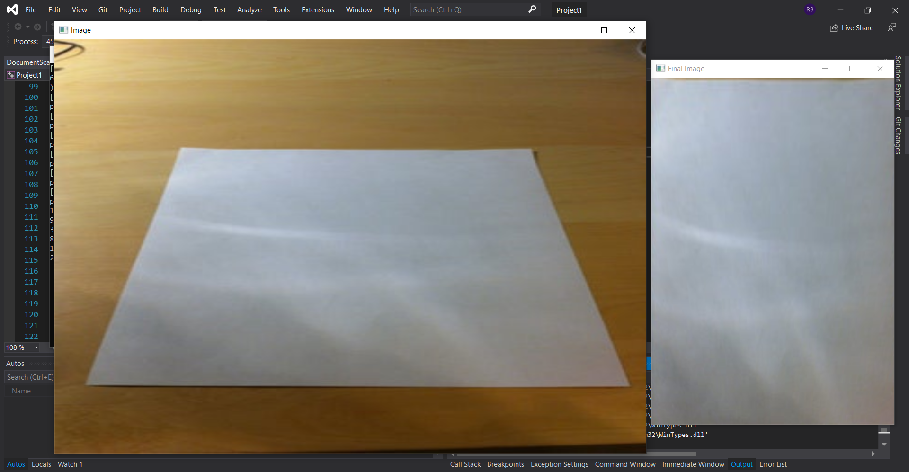

# DocumentScanner
<strong>C++ project to scan a document from given image and save the top view of the document to a new destination.

  Uses concepts like- 
1)Image Dilation 
2)Contour Detection 
3)Warp Perspective<strong>

