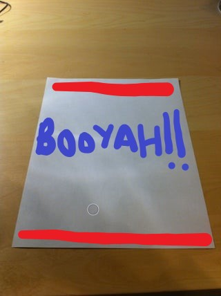
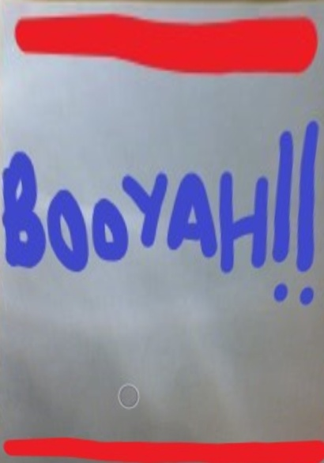

<h1>DocumentScanner</h1> 
<h4><strong><em>C++ project to scan a document from given image and save the top view of the document to a new destination.</em></h4>

Uses concepts like- 
1) Image Dilation 
2) Contour Detection 
3) Warp Perspective<strong>

  
 Examples

  

  
  <h4>Raw Image</h4>
  

  
  <h4>Processed Image</h4>
  
  
  

